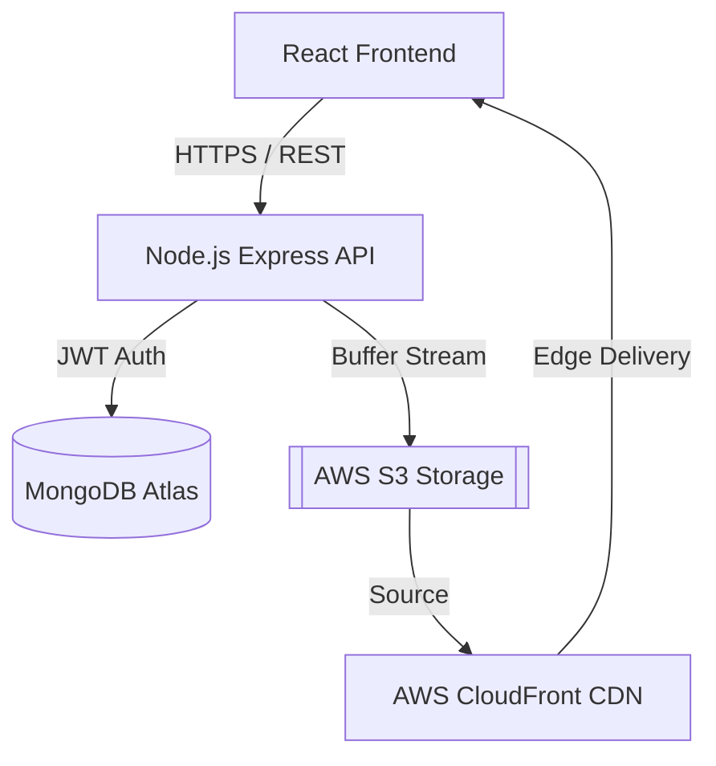

# Fotos System Architecture

Fotos is a cloud-native platform designed for high-concurrency event photo sharing. It utilizes a three-tier architecture with pluggable persistence layers.

## 1. System Topology

## 2. Infrastructure Modes

The application dynamically selects providers based on environment availability:

- **Local Discovery**: Uses JSON persistence and local file system uploads.
- **Enterprise Cloud**: Uses MongoDB Atlas for metadata and AWS S3/CloudFront for object delivery.

| Provider | Local Configuration | Cloud Configuration |
| :--- | :--- | :--- |
| **Data** | `backend/data/db.json` | `MONGODB_URI` (Atlas) |
| **Storage** | `backend/uploads/` | `AWS_S3_BUCKET` (S3) |
| **Delivery** | direct host | `AWS_CLOUDFRONT_URL` (CDN) |

## 3. Performance & Scalability

### 3.1 Masonry Layout (Frontend)
To handle varying photo aspect ratios without layout shift, we use a CSS-columns based masonry grid. This provides high-performance rendering compared to JS-heavy masonry libraries.

### 3.2 Denormalized Ratings (Backend)
To support **Top Rated** sorting across millions of records without complex aggregation overhead, we implement a denormalization strategy:
- Every `Photo` record stores `averageRating` and `ratingsCount`.
- These fields are updated atomically via Mongoose aggregation whenever a user submits a rating.
- This allows the primary gallery query to stay O(1) for sorting.

### 3.3 CDN Rewriting
The `resolveAssetUrl` utility automatically prioritizes CDN distribution points (CloudFront) if configured, reducing latency and offloading traffic from the API server.

## 4. Technology Stack

- **UI**: React 18, Framer Motion (Animations), Lucide (Icons)
- **Design**: HSL-based Design System with Glassmorphism
- **Backend**: Node.js, Express, JWT, Multer
- **Persistence**: Mongoose (ODM), MongoDB Atlas
- **DevOps**: GitHub Actions (CI/CD), Render/Amazon EC2 (Deployment)
